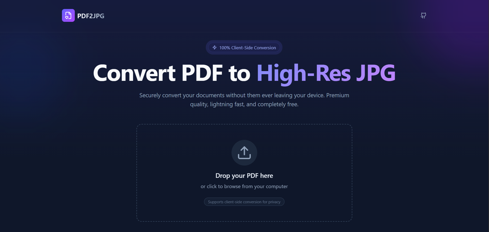

# iHatePDF - PDF & Image Converter


A modern, fast, and secure web application to convert PDF documents into high-resolution JPG images. Designed with a focus on privacy, **files are processed entirely on your device** and never uploaded to a server.

## 📸 Preview



## 🔗 Live Demo
Check out the live application here: **[https://pdf-to-jpg-five.vercel.app](https://pdf-to-jpg-five.vercel.app)**

## ✨ Key Features

* **🔒 100% Client-Side Privacy:** Your documents never leave your device. All conversion happens locally in the browser.
* **⚡ High-Res Output:** Generates premium quality JPGs suitable for professional use.
* **� Dual Mode:** Easily switch between **PDF to JPG** extraction and **JPG to PDF** compilation.
* **�🚀 Lightning Fast:** Built with Vite for instant loading and rapid processing.
* **📂 Drag & Drop Interface:** Simple, intuitive UI—just drop your file to start.
* **🌑 Modern Dark Mode:** A clean, aesthetic user interface designed for focus.

## 🛠️ Tech Stack

* **Frontend Framework:** React.js
* **Build Tool:** Vite
* **Styling:** CSS / Tailwind (if applicable)
* **PDF Engine:** pdf.js (Client-side rendering)

## 🚀 Getting Started

Follow these instructions to set up the project locally on your machine.

### Prerequisites

* Node.js (v14 or higher)
* npm (v6 or higher)

### Installation

1.  **Clone the repository**
    ```bash
    git clone [https://github.com/saquibkhan413/PDF-to-JPG.git](https://github.com/saquibkhan413/PDF-to-JPG.git)
    cd PDF-to-JPG
    ```

2.  **Install dependencies**
    ```bash
    npm install
    ```

3.  **Start the development server**
    ```bash
    npm run dev
    ```

4.  **Open in Browser**
    The application will launch at `http://localhost:5173`.

## 🤝 Contributing

Contributions are welcome! If you have ideas for new features or improvements:

1.  Fork the repository.
2.  Create a feature branch (`git checkout -b feature/NewFeature`).
3.  Commit your changes.
4.  Push to the branch.
5.  Open a Pull Request.

## 📄 License

This project is licensed under the MIT License - see the [LICENSE](LICENSE) file for details.

---
**Developed by [Saquib Khan](https://github.com/saquibkhan413)**
